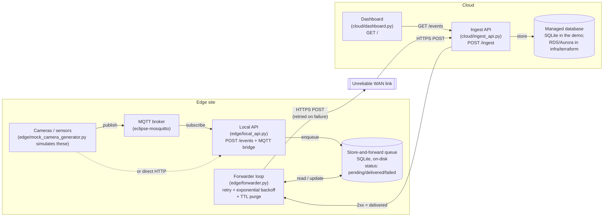

# Hybrid Edge/Cloud Reference Architecture

This repo is a working example of how to design an AI-vision-style deployment
that spans edge sites, on-prem hardware, and the cloud, and how to keep it
reliable when the network link between the edge and the cloud isn't. It
answers two closely related questions that come up in almost every
multi-site deployment: **where should inference actually run** (on a box at
the site, or in the cloud), and **how do you not lose data** when the WAN
link between a site and the cloud drops, which it will. The centerpiece is a
real, tested "store-and-forward" edge service: a small local queue that
durably holds events during an outage and flushes them to the cloud once the
link recovers, with retries, backoff, and a data-retention policy.

## Why this matters

Anyone designing deployments for multiple physical sites runs into the same
problem sooner or later: the network connecting a site to "the cloud" is not
a clean, always-on pipe. It's a retail store's shared internet connection, a
warehouse's cellular failover link, a remote site with a maintenance window
every night. If a system assumes the cloud is always reachable, it either
loses data during every outage or grinds to a halt waiting for a connection
that isn't there. Designing around that reality -- deciding what has to run
locally, what can run centrally, and how the two sides stay consistent when
they can't talk to each other -- is a recurring, generic problem, not a
one-off. This repo works through it end to end, in code you can actually run.

## Architecture



Everything above the "unreliable WAN link" runs at the edge site, on-prem,
close to the cameras -- so it keeps working even when the site is offline.
Everything below it runs in the cloud, and only ever sees what the forwarder
has successfully delivered.

## Design decisions

**Why hybrid edge/cloud/on-prem, instead of "just the cloud" or "just
on-prem"?** All-cloud assumes a WAN link that is fast and always up, which
is not a safe assumption across many real sites, and it puts every camera's
raw video on a network you don't fully control. All-on-prem avoids the
network dependency but gives up centralized visibility, fleet-wide
analytics, and easy multi-site reporting. A hybrid split -- inference and
short-term durability at the edge, aggregation and long-term storage in the
cloud -- gets the reliability and privacy benefits of local processing
without giving up a central view of the whole fleet.

**Why store-and-forward, instead of dropping events or requiring synchronous
delivery?** Dropping events on a failed delivery silently loses data every
time the link blips, which for anything resembling an audit trail or
analytics pipeline is unacceptable. Requiring synchronous, successful
delivery before considering an event "done" means a WAN outage blocks
whatever's producing events, which is worse. Store-and-forward decouples the
two: an event is durable the moment it's queued locally, and delivery
happens in the background, independent of the producer. See
`docs/architecture-decision-records/ADR-001-store-and-forward-for-intermittent-wan.md`.

**Why MQTT locally but HTTPS to the cloud?** Locally, MQTT gives cheap
pub/sub fan-out on constrained hardware, which suits a handful of local
producers and consumers on the same LAN. Across the WAN, HTTPS is what
survives standard corporate firewalls/proxies, gives unambiguous
request/response semantics (2xx vs. not) that map directly onto the
forwarder's retry logic, and is trivial to put behind a load balancer or API
gateway on the cloud side. See
`docs/architecture-decision-records/ADR-002-mqtt-at-edge-https-to-cloud.md`.

**Why Terraform for the cloud IaC layer?** Declarative infrastructure that's
checked into version control means every change to the cloud environment is
visible in a diff, reviewable before it happens, and reproducible -- rerun
the same configuration and get the same infrastructure. Manual console
changes leave no history, are easy to forget, and are hard to replicate
across environments (dev/staging/production). Terraform isn't the only tool
that gets you this, but it's a common, cloud-agnostic-enough choice that most
engineers will recognize.

**Where should inference run?** Per camera or zone, not globally --
`docs/decision-framework.md` walks through it in detail, but the short
version: any camera tied to a real-time control loop (a gate, a conveyor, an
access decision) or a hard data-sovereignty requirement runs inference at
the edge, no matter how good the site's link currently is. Large camera
counts and unreliable links push toward edge inference too, for bandwidth
and resilience reasons. Cloud-only inference is the exception, reserved for
small, well-connected, low-stakes sites. Regardless of where inference runs,
the resulting *events* cross the WAN via the store-and-forward path
described above.

## Setup & run instructions

You'll need Docker and Docker Compose. Everything below has been verified to
build and run as described.

### 1. Create a shared network

The edge and cloud stacks are separate Compose projects but need to reach
each other by service name for the demo. Create the shared network once:

```bash
docker network create hybrid_net
```

### 2. Start the cloud stack first

```bash
docker compose -f docker-compose.cloud.yml up -d --build
```

This starts:
- `ingest-api` on `http://localhost:8080` (`POST /ingest`, `GET /events`, `GET /health`)
- `dashboard` on `http://localhost:8090` (a plain HTML page listing recent events)

Check it's alive:

```bash
curl http://localhost:8080/health
```

### 3. Start the edge stack

```bash
docker compose -f docker-compose.edge.yml up -d --build
```

This starts:
- `mosquitto` -- the local MQTT broker (internal to the compose network only)
- `mock-camera-generator` -- publishes fake camera events to MQTT every few seconds
- `local-api` on `http://localhost:8000` (`POST /events`, `GET /health`) -- also bridges MQTT messages into the queue
- `forwarder` -- delivers whatever's queued to the cloud's `ingest-api`, using `CLOUD_INGEST_URL=http://ingest-api:8080/ingest` (resolvable because both stacks share `hybrid_net`)

### 4. Watch events flow end to end

```bash
# Post an event directly to the edge site
curl -X POST http://localhost:8000/events \
  -H "Content-Type: application/json" \
  -d '{"source": "camera-01", "event_type": "person_detected", "data": {"confidence": 0.95}}'

# A few seconds later, it (and the mock camera generator's events) should
# show up on the cloud side:
curl http://localhost:8080/events
```

Or open `http://localhost:8090` in a browser to see the same thing rendered
as a simple table.

### 5. Simulate an outage

Stop the cloud stack while the edge stack keeps running:

```bash
docker compose -f docker-compose.cloud.yml down
```

Post more events to `http://localhost:8000/events` -- they queue up locally
(`curl http://localhost:8000/health` shows a growing `pending` count).
Bring the cloud back up and watch the queue drain:

```bash
docker compose -f docker-compose.cloud.yml up -d
```

### Tear down

```bash
docker compose -f docker-compose.edge.yml down -v
docker compose -f docker-compose.cloud.yml down -v
docker network rm hybrid_net
```

## Project structure

```
.
├── edge/
│   ├── forwarder.py            # store-and-forward queue + delivery loop (the centerpiece)
│   ├── local_api.py             # POST /events, MQTT bridge into the queue
│   ├── mock_camera_generator.py # simulates a small camera fleet over MQTT
│   ├── mosquitto.conf            # minimal local broker config for the demo
│   └── __init__.py
├── cloud/
│   ├── ingest_api.py             # POST /ingest, GET /events -- cloud-side ingestion
│   ├── dashboard.py              # tiny HTML page listing recent events
│   └── __init__.py
├── infra/terraform/              # illustrative cloud IaC (ALB + ECS/Fargate + RDS)
│   ├── main.tf
│   ├── variables.tf
│   ├── outputs.tf
│   └── versions.tf
├── docs/
│   ├── decision-framework.md     # edge vs. cloud inference checklist + flowchart
│   └── architecture-decision-records/
│       ├── ADR-001-store-and-forward-for-intermittent-wan.md
│       ├── ADR-002-mqtt-at-edge-https-to-cloud.md
│       └── ADR-003-edge-inference-for-latency-sensitive-zones.md
├── tests/
│   ├── conftest.py               # FakeClock + mock cloud endpoint fixtures
│   ├── test_forwarder.py         # the main store-and-forward test suite
│   ├── test_ingest_api.py
│   ├── test_local_api.py
│   ├── test_mqtt_bridge.py
│   └── test_end_to_end.py        # local API -> forwarder -> real cloud app, in-process
├── docker-compose.edge.yml
├── docker-compose.cloud.yml
├── Dockerfile.edge
├── Dockerfile.cloud
├── requirements.txt
├── pyproject.toml
├── .github/workflows/ci.yml
├── LICENSE
└── README.md
```

## Testing

```bash
pip install -r requirements.txt
pytest -v
```

All 15 tests pass. The suite in `tests/test_forwarder.py` is the one worth
reading closely -- it exercises the store-and-forward logic directly against
a real temp-file SQLite database, with the network call swapped for an
`httpx.MockTransport` that can be flipped "up"/"down" mid-test, and a fake,
manually-advanced clock so retry/backoff/TTL timing can be tested without
real sleeping. It covers:

- the cloud endpoint being down -> events stay `pending`, `attempt_count`
  increments, and the retry backoff grows (1s, 2s, 4s, 8s, ...);
- the cloud endpoint recovering -> every queued event flushes, in the order
  it was created, and gets marked `delivered`;
- the TTL purge -> an undelivered event older than the configured retention
  window gets removed, while a newer one is left alone;
- delivered events getting purged from the local queue once acknowledged.

`tests/test_end_to_end.py` wires the real edge local API, the real
`Forwarder`, and the real cloud ingest API together (via httpx's in-process
ASGI transport, no real sockets) to prove the whole pipeline agrees on the
wire format, not just that each piece works in isolation against a mock of
the other.

Lint with:

```bash
ruff check .
```

## Limitations & production hardening notes

This is a reference architecture, sized for clarity, not a production
system. Before using anything like this for real, at minimum you'd want to
add:

- **Real authentication between edge and cloud.** The demo's `POST /ingest`
  accepts anything. A real deployment needs mutual TLS or a signed
  token/API key per edge site, so the cloud can trust who's sending it data
  and revoke a compromised site's access.
- **Encryption of the on-disk queue.** The SQLite queue file at the edge is
  stored in plaintext in this demo. If the events contain anything
  sensitive, the file (or the disk it lives on) should be encrypted at rest.
- **Deduplication on the cloud side.** Store-and-forward is "at least once"
  delivery -- a delivery can succeed while its acknowledgment is lost,
  causing a retry of an already-stored event. The demo's ingest API does not
  deduplicate; a real one should, using an idempotency key generated at the
  edge.
- **Multi-region cloud failover.** `infra/terraform/` provisions a single
  ALB/ECS/RDS stack in one region. A production cloud side would need a
  failover story (multi-AZ at minimum, multi-region for higher availability
  requirements) that this reference module does not attempt.
- **Real Terraform remote state and a real backend.** The Terraform module
  here uses local state so `terraform validate` works with zero setup. Real
  use needs a remote backend (S3 + DynamoDB lock table, Terraform Cloud,
  etc.) -- see the commented-out `backend` block in
  `infra/terraform/versions.tf`.
- **Secrets management.** `infra/terraform/variables.tf` has a placeholder
  `db_password` variable with a comment telling you not to do that for real;
  a real deployment sources database and API credentials from a secrets
  manager, not a tfvars file.
- **Observability.** Structured logging, metrics on queue depth/delivery
  latency/failure rate, and alerting on a queue that's growing without
  draining would all be necessary to operate this for real -- right now the
  forwarder only logs to stdout.

## License

MIT. See `LICENSE`.
