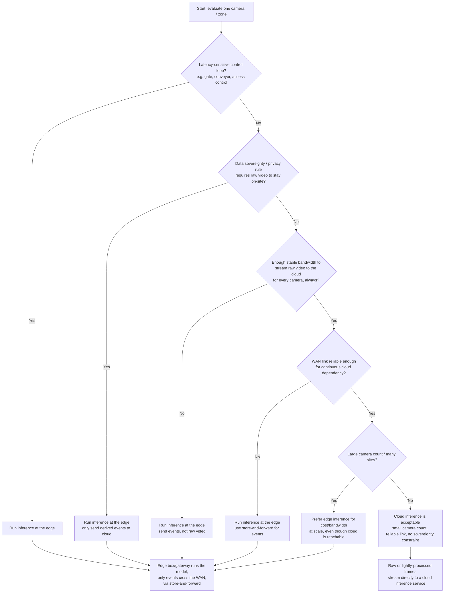

# Decision framework: should this camera's inference run at the edge or in the cloud?

This is a working checklist for deciding, per camera (or per zone/site), whether
AI vision inference should run locally at the edge or be shipped to the cloud
for processing. Most real deployments end up mixed: some cameras run edge
inference, others don't, based on the answers below.

## Checklist

Go through these five questions for each camera or camera group.

1. **Latency sensitivity** - Does anything need to react to this camera's
   output in under ~1 second (e.g. triggering a physical gate, stopping a
   conveyor, an access-control decision)? If yes, that pushes hard toward
   edge inference -- a round trip to the cloud and back is rarely fast or
   reliable enough for a real-time control loop.
2. **Available bandwidth** - Is there enough consistent upstream bandwidth to
   send raw or lightly-compressed video to the cloud for every camera, all
   the time? If not (many sites, limited WAN, metered/cellular links), either
   run inference at the edge and only send *events* (small JSON payloads)
   to the cloud, or downsample/reduce what's sent.
3. **Data sovereignty / privacy** - Does raw video need to stay on-site for
   legal, contractual, or privacy reasons (e.g. it must never leave a
   specific building, region, or country)? If yes, edge inference is close
   to mandatory -- only derived, non-identifying events go to the cloud.
4. **Camera count / scale** - Is this one camera or hundreds across many
   sites? A handful of cameras at one site can often just stream to the
   cloud. Hundreds of cameras across many sites usually make per-site edge
   inference cheaper and more bandwidth-efficient than centralizing
   everything.
5. **Connectivity reliability** - Is the WAN link at this site prone to
   outages or degraded service (rural sites, cellular backhaul, shared
   infrastructure)? If yes, the site needs to keep working -- and keep
   detecting things -- even while disconnected, which means local inference
   plus a store-and-forward queue for the resulting events (see
   `docs/architecture-decision-records/ADR-001-store-and-forward-for-intermittent-wan.md`).

## Flowchart

## How to read the result

- Any single "edge" answer for a camera is usually enough to justify edge
  inference for that camera, even if the others would have allowed cloud
  processing -- the constraints are not mutually exclusive, and edge
  inference is the safer default when in doubt.
- "Cloud is acceptable" should be treated as the *exception*, not the
  default, for any deployment with more than a few cameras, more than one
  site, or any privacy/compliance requirement. In practice, most multi-site
  camera deployments end up doing edge inference for the majority of
  cameras and reserving cloud-only processing for low-stakes, low-camera-count,
  well-connected single sites.
- Regardless of where inference runs, the edge-to-cloud transport of
  *events* (not necessarily raw video) should be store-and-forward so that a
  WAN outage causes a delay, not data loss. See the ADRs in
  `docs/architecture-decision-records/` for the reasoning behind that and
  related choices.
